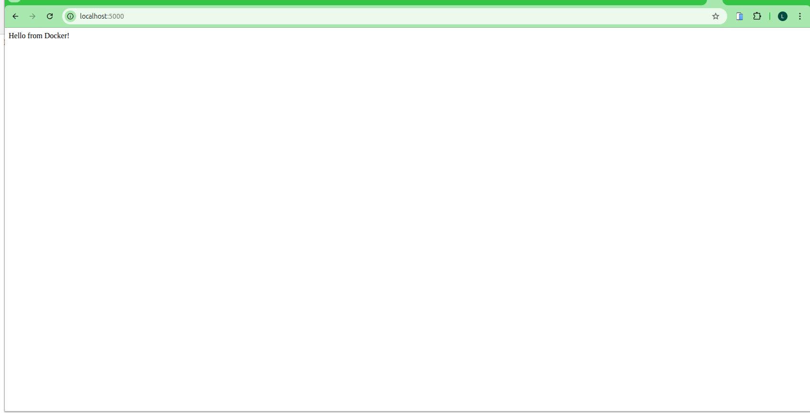

# Docker Flask Sample Application

A simple Python Flask web application containerized using Docker. This project demonstrates the basics of containerizing a Python web application and deploying it using Docker.

## Table of Contents

- [Overview](#overview)
- [Prerequisites](#prerequisites)
- [Project Structure](#project-structure)
- [Installation & Setup](#installation--setup)
- [Usage](#usage)
- [Docker Commands](#docker-commands)
- [Application Screenshot](#application-screenshot)
- [Technologies Used](#technologies-used)
- [Lab Assignment](#lab-assignment)

## Overview

This is a minimal Flask web application that serves a simple greeting message. The application is containerized using Docker, making it easy to deploy and run consistently across different environments.

**Key Features:**
- Simple Flask web server with one route
- Dockerized for easy deployment
- Runs on port 5000
- Lightweight using Python 3.9 slim base image

## Prerequisites

Before you begin, ensure you have the following installed:

- **Docker**: Version 20.x or higher
  - [Install Docker on Linux](https://docs.docker.com/engine/install/)
  - [Install Docker Desktop on Mac](https://docs.docker.com/desktop/install/mac-install/)
  - [Install Docker Desktop on Windows](https://docs.docker.com/desktop/install/windows-install/)
- **Git** (optional, for cloning the repository)

Verify Docker installation:
```bash
docker --version
```

## Project Structure

```
Docker_Sample_Application/
│
├── app.py              # Flask application main file
├── Dockerfile          # Docker configuration file
├── README.md           # Project documentation (this file)
├── assignment.pdf      # Lab assignment guide
├── .gitignore         # Git ignore file
│
└── assets/            # Project assets and screenshots
    └── web1.png       # Application running screenshot
```

## Installation & Setup

### Step 1: Clone or Navigate to Project Directory

```bash
cd /path/to/Docker_Sample_Application
```

### Step 2: Build the Docker Image

Build the Docker image with the tag `flask-app`:

```bash
docker build -t flask-app .
```

This command will:
- Use the Python 3.9 slim base image
- Set up the working directory as `/app`
- Copy all project files into the container
- Install Flask using pip
- Configure the container to expose port 5000

### Step 3: Run the Docker Container

Run the container in detached mode, mapping port 5000:

```bash
docker run -d -p 5000:5000 flask-app
```

**Flags explained:**
- `-d`: Run container in detached mode (background)
- `-p 5000:5000`: Map host port 5000 to container port 5000
- `flask-app`: Name of the image to run

## Usage

### Accessing the Application

Once the container is running, access the application by opening your web browser and navigating to:

```
http://localhost:5000
```

You should see the message: **"Hello from Docker!"**

### Testing with curl

You can also test the application using curl:

```bash
curl http://localhost:5000
```

**Expected output:**
```
Hello from Docker!
```

## Docker Commands

### Essential Docker Commands

#### View Running Containers
```bash
docker ps
```

#### View All Containers (including stopped)
```bash
docker ps -a
```

#### View Container Logs
```bash
docker logs <container-id>
```

#### Stop the Container
```bash
docker stop <container-id>
```

#### Start a Stopped Container
```bash
docker start <container-id>
```

#### Remove a Container
```bash
docker rm <container-id>
```

#### Remove the Image
```bash
docker rmi flask-app
```

#### View Docker Images
```bash
docker images
```

#### Execute Commands Inside Running Container
```bash
docker exec -it <container-id> /bin/bash
```

#### Remove Stopped Containers
```bash
docker container prune
```

## Application Screenshot

The application successfully running in a web browser:



**Screenshot Analysis:**

The screenshot (`web1.png`) demonstrates the Flask application successfully deployed and running in a Docker container. Key observations:

1. **Successful Deployment**: The application is accessible through a web browser at `localhost:5000`
2. **Expected Output**: The page displays "Hello from Docker!" confirming the Flask route is working correctly
3. **Containerized Environment**: The application is running within the Docker container, isolated from the host system
4. **Port Mapping**: The port mapping (5000:5000) is functioning properly, allowing external access to the containerized application

This validates that:
- The Dockerfile was built successfully
- The Flask application was properly containerized
- The container is running and accessible
- The application logic is executing as expected

## Technologies Used

- **Python 3.9**: Programming language
- **Flask**: Lightweight web framework
- **Docker**: Containerization platform
- **python:3.9-slim**: Minimal Docker base image (Debian-based)

### Application Details

**app.py Configuration:**
- Host: `0.0.0.0` (binds to all network interfaces)
- Port: `5000` (default Flask port)
- Single route: `/` returns "Hello from Docker!"

**Dockerfile Configuration:**
- Base Image: `python:3.9-slim`
- Working Directory: `/app`
- Dependencies: Flask (installed via pip)
- Exposed Port: `5000`
- Entry Point: `python app.py`

## Lab Assignment

This project is based on a lab assignment focused on Docker containerization. The assignment guide (`assignment.pdf`) contains detailed instructions for:

- Understanding Docker fundamentals
- Creating Dockerfiles
- Building and running containers
- Working with Docker commands
- Container networking and port mapping

**Learning Objectives:**
1. Understand the basics of containerization
2. Learn how to create a Dockerfile
3. Build Docker images from Dockerfiles
4. Run and manage Docker containers
5. Understand port mapping and networking in Docker

## Troubleshooting

### Port Already in Use

If port 5000 is already in use, you can map to a different host port:

```bash
docker run -d -p 8080:5000 flask-app
```

Then access the application at `http://localhost:8080`

### Container Won't Start

Check container logs:
```bash
docker logs <container-id>
```

### Image Build Fails

Ensure you're in the correct directory with `Dockerfile` and `app.py`:
```bash
ls -la
```

### Permission Denied

On Linux, you might need to run Docker commands with sudo or add your user to the docker group:
```bash
sudo usermod -aG docker $USER
```

## Notes

- The application uses Flask's development server, which is suitable for learning and development but **not recommended for production**
- For production deployments, consider using a production WSGI server like Gunicorn or uWSGI
- The slim Python image reduces the final image size while maintaining essential functionality
- Container data is ephemeral; stopping and removing the container will delete any data not stored in volumes

## Contributing

This is a learning project for Docker fundamentals. Feel free to:
- Experiment with different base images
- Add more routes to the Flask application
- Implement environment variables
- Add Docker Compose for multi-container setups

## License

This is an educational project created for my knowledge on docker purposes.
